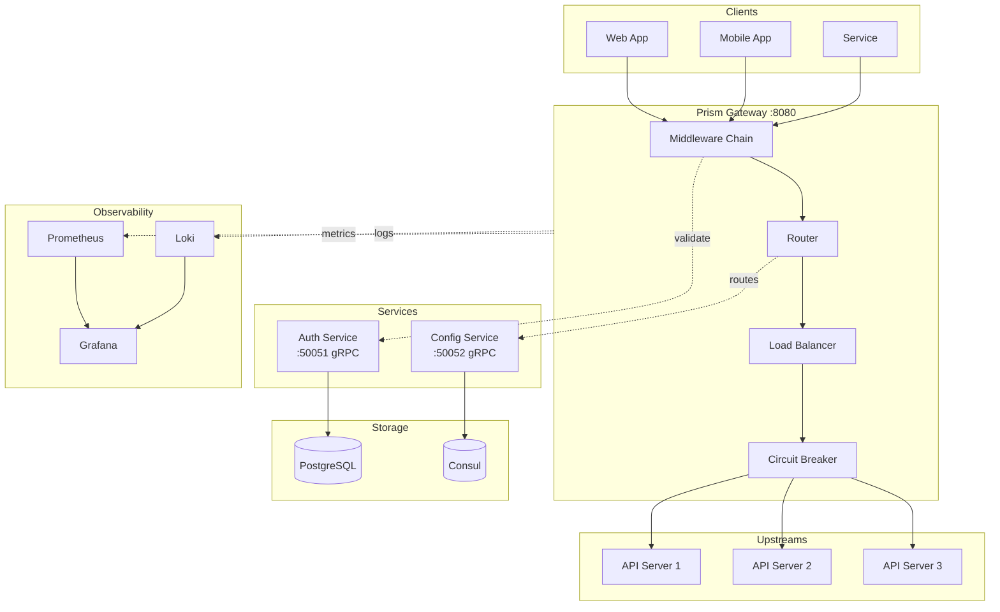
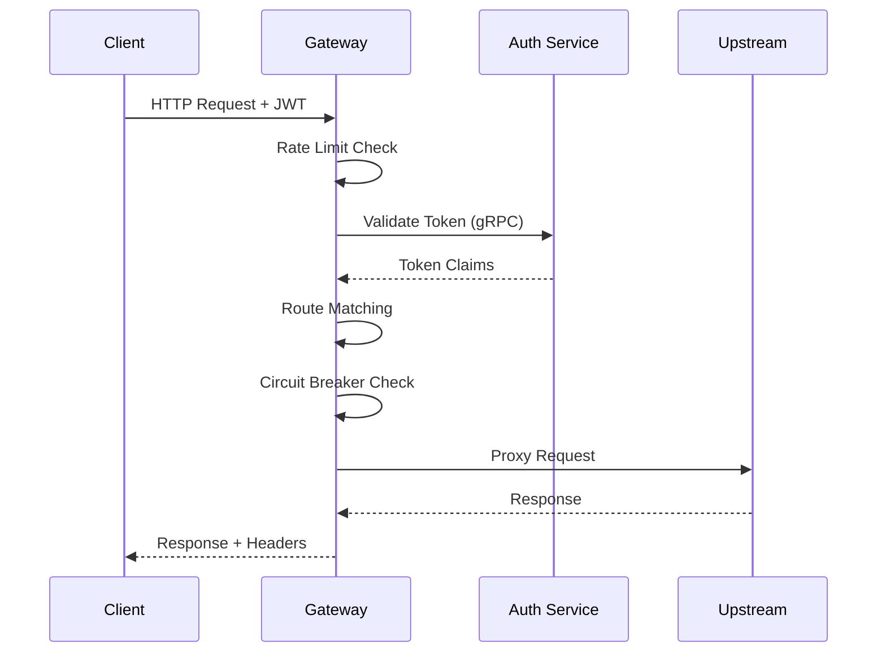
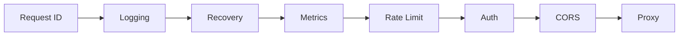

# Prism

<p align="center">
  <strong>Production-Ready Microservices API Gateway</strong>
</p>

<p align="center">
  <a href="#features">Features</a> •
  <a href="#quick-start">Quick Start</a> •
  <a href="#architecture">Architecture</a> •
  <a href="docs/guides">Documentation</a>
</p>

<p align="center">
  
  
  
  
</p>

---

**Prism** is a high-performance, microservices-based reverse proxy API gateway built with Go. It provides authentication, authorization, rate limiting, circuit breaking, and comprehensive observability—everything you need for production-grade API management.

## Features

| Category | Features |
|----------|----------|
| **Routing** | Dynamic routing, path rewriting, load balancing (round-robin, weighted, least-conn) |
| **Security** | JWT (RS256), OAuth 2.0 (Google, GitHub), API keys, TLS/HTTPS |
| **Resilience** | Circuit breaker, rate limiting (token bucket), request timeouts, retries |
| **Observability** | Prometheus metrics, structured logging (Loki), Grafana dashboards |
| **Operations** | Health checks, graceful shutdown, hot-reload config, Docker support |

## Architecture



### Request Flow



### Middleware Chain



## Quick Start

### Prerequisites

- Go 1.23+
- Docker & Docker Compose
- Make

### Run with Docker

```bash
# Clone and start
git clone https://github.com/carlossalguero/prism.git
cd prism

# Generate JWT keys
make generate-keys

# Start all services
make docker-up

# Verify
curl http://localhost:8080/health
```

### Run Locally

```bash
# Start infrastructure
make docker-up

# Build services
make build

# Run (in separate terminals)
./bin/auth
./bin/gateway
```

### Access Points

| Service | URL | Description |
|---------|-----|-------------|
| Gateway | `http://localhost:8080` | API Gateway |
| Auth HTTP | `http://localhost:8081` | OAuth callbacks |
| Grafana | `http://localhost:3000` | Dashboards (admin/admin) |
| Consul | `http://localhost:8500` | Service discovery |
| Prometheus | `http://localhost:9090` | Metrics |

## Usage

### Authentication

```bash
# Register
curl -X POST http://localhost:8081/auth/register \
  -H "Content-Type: application/json" \
  -d '{"email": "user@example.com", "password": "secure123", "name": "User"}'

# Login - returns JWT tokens
curl -X POST http://localhost:8081/auth/login \
  -H "Content-Type: application/json" \
  -d '{"email": "user@example.com", "password": "secure123"}'
```

### API Requests

```bash
# With JWT
curl http://localhost:8080/api/v1/resource \
  -H "Authorization: Bearer <access_token>"

# With API Key
curl http://localhost:8080/api/v1/resource \
  -H "X-API-Key: prism_abc123..."
```

## Project Structure

```
prism/
├── services/
│   ├── gateway/          # API Gateway
│   │   ├── cmd/          # Entrypoint
│   │   └── internal/     # Proxy, router, middleware, circuit breaker
│   ├── auth/             # Authentication Service
│   │   ├── cmd/          # Entrypoint
│   │   └── internal/     # JWT, OAuth, repository, service
│   ├── config/           # Configuration Service
│   │   ├── cmd/          # Entrypoint
│   │   └── internal/     # Consul client, service, server
│   └── shared/           # Shared Libraries
│       ├── errors/       # Error types with HTTP/gRPC mapping
│       ├── health/       # Health check infrastructure
│       ├── logger/       # Structured logging (slog)
│       ├── metrics/      # Prometheus metrics
│       ├── tls/          # TLS configuration
│       └── proto/        # Protocol Buffers
├── configs/              # YAML configuration files
├── migrations/           # Database migrations
├── deploy/               # Docker, docker-compose, observability
└── docs/guides/          # Documentation
```

## Documentation

| Guide | Description |
|-------|-------------|
| [Configuration](docs/guides/configuration.md) | Service configuration options |
| [Authentication](docs/guides/authentication.md) | JWT, OAuth, API keys |
| [Routing](docs/guides/routing.md) | Route configuration and load balancing |
| [Observability](docs/guides/observability.md) | Metrics, logging, tracing |
| [Deployment](docs/guides/deployment.md) | Docker, Kubernetes |

## Development

```bash
make build           # Build all services
make test            # Run tests
make test-coverage   # Generate coverage report
make lint            # Run linter
make proto           # Generate protobuf code
make fmt             # Format code
```

## Contributing

1. Fork the repository
2. Create a feature branch (`git checkout -b feature/amazing`)
3. Commit changes (`git commit -m 'Add amazing feature'`)
4. Push to branch (`git push origin feature/amazing`)
5. Open a Pull Request

## License

MIT License - see [LICENSE](LICENSE) for details.

---

<p align="center">
  Built with Go • Powered by gRPC • Monitored by Prometheus
</p>
