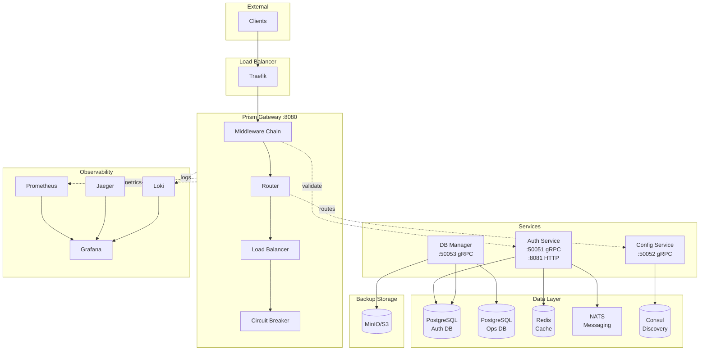
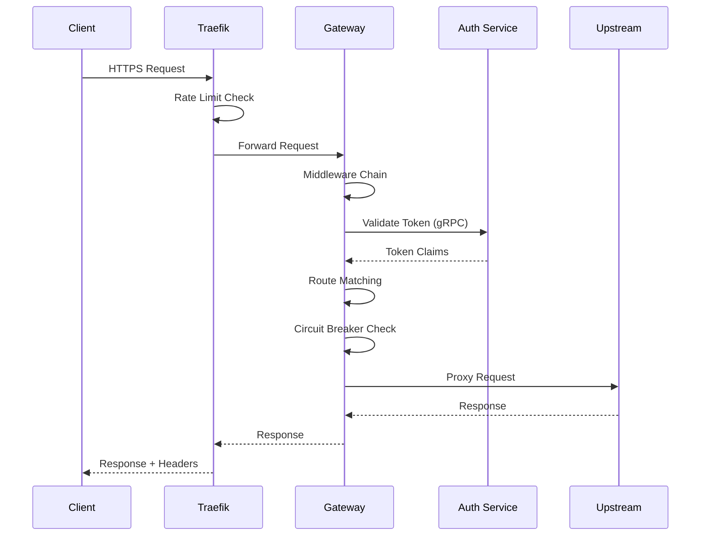

# Prism

<p align="center">
  <strong>Production-Ready Microservices API Gateway</strong>
</p>

<p align="center">
  <a href="#features">Features</a> •
  <a href="#quick-start">Quick Start</a> •
  <a href="#architecture">Architecture</a> •
  <a href="docs/guides">Documentation</a>
</p>

<p align="center">
  
  
  
  
</p>

---

**Prism** is a high-performance, microservices-based reverse proxy API gateway built with Go. It provides authentication, authorization, rate limiting, circuit breaking, and comprehensive observability—everything you need for production-grade API management.

## Features

| Category | Features |
|----------|----------|
| **Routing** | Dynamic routing, path rewriting, load balancing (round-robin, weighted, least-conn) |
| **Security** | JWT (RS256), OAuth 2.0 (Google, GitHub), API keys, TLS/HTTPS, mTLS |
| **Resilience** | Circuit breaker, rate limiting (token bucket), request timeouts, retries |
| **Observability** | Prometheus metrics, Jaeger tracing, structured logging (Loki), Grafana dashboards |
| **Infrastructure** | Dual PostgreSQL, Redis caching, NATS messaging, Consul service discovery |
| **Operations** | Health checks, graceful shutdown, automated backups, DB migrations |

## Architecture



### Request Flow



## Quick Start

### Prerequisites

- Go 1.23+
- Docker & Docker Compose
- Make

### Development Setup (Recommended)

```bash
# Clone the repository
git clone https://github.com/carlossalguero/prism.git
cd prism

# Run the development setup script
# This will: generate keys, create .env, start infrastructure, run migrations
make dev-setup
```

### Manual Setup

```bash
# 1. Copy and configure environment
cp deploy/docker-compose/.env.example deploy/docker-compose/.env
# Edit .env with your passwords

# 2. Generate JWT keys
make generate-keys

# 3. Start infrastructure (PostgreSQL, Redis, NATS, Consul, MinIO)
make docker-infra-up

# 4. Start observability stack (Prometheus, Jaeger, Loki, Grafana)
make docker-obs-up

# 5. Build and start core services
make build
make docker-up

# Verify
curl http://localhost:8080/health
```

### Access Points

| Service | URL | Description |
|---------|-----|-------------|
| Gateway | `http://localhost:8080` | API Gateway |
| Auth HTTP | `http://localhost:8081` | OAuth callbacks |
| Grafana | `http://localhost:3000` | Dashboards |
| Prometheus | `http://localhost:9090` | Metrics |
| Jaeger | `http://localhost:16686` | Distributed Tracing |
| Consul | `http://localhost:8500` | Service Discovery |
| MinIO Console | `http://localhost:9001` | Backup Storage |
| NATS Monitoring | `http://localhost:8222` | Message Queue |

## Docker Compose Commands

```bash
# Infrastructure only (databases, cache, messaging)
make docker-infra-up
make docker-infra-down

# Observability stack (monitoring, logging, tracing)
make docker-obs-up
make docker-obs-down

# Core services (gateway, auth, config)
make docker-up
make docker-down

# Everything at once
make docker-full-up
make docker-full-down

# View logs
make docker-logs service=gateway

# Clean up (removes volumes)
make docker-clean
```

## Usage

### Authentication

```bash
# Register
curl -X POST http://localhost:8081/auth/register \
  -H "Content-Type: application/json" \
  -d '{"email": "user@example.com", "password": "secure123", "name": "User"}'

# Login - returns JWT tokens
curl -X POST http://localhost:8081/auth/login \
  -H "Content-Type: application/json" \
  -d '{"email": "user@example.com", "password": "secure123"}'
```

### API Requests

```bash
# With JWT
curl http://localhost:8080/api/v1/resource \
  -H "Authorization: Bearer <access_token>"

# With API Key
curl http://localhost:8080/api/v1/resource \
  -H "X-API-Key: prism_abc123..."
```

### Database Operations

```bash
# Create backup
make backup-all

# List backups
make backup-list
```

## Project Structure

```
prism/
├── services/
│   ├── gateway/          # API Gateway
│   │   ├── cmd/          # Entrypoint
│   │   └── internal/     # Proxy, router, middleware, circuit breaker
│   ├── auth/             # Authentication Service
│   │   ├── cmd/          # Entrypoint
│   │   └── internal/     # JWT, OAuth, repository, service
│   ├── config/           # Configuration Service
│   │   ├── cmd/          # Entrypoint
│   │   └── internal/     # Consul client, service, server
│   ├── dbmanager/        # Database Management Service
│   │   ├── cmd/          # Entrypoint
│   │   └── internal/     # Migration, backup, health, scheduler
│   └── shared/           # Shared Libraries
│       ├── cache/        # Redis client wrapper
│       ├── events/       # NATS client wrapper
│       ├── tracing/      # OpenTelemetry setup
│       ├── errors/       # Error types
│       ├── health/       # Health check infrastructure
│       ├── logger/       # Structured logging (slog)
│       ├── metrics/      # Prometheus metrics
│       ├── tls/          # TLS configuration
│       └── proto/        # Protocol Buffers
├── configs/              # YAML configuration files
├── migrations/
│   ├── auth/             # Auth database migrations
│   └── ops/              # Operational database migrations
├── deploy/
│   ├── docker/           # Dockerfiles
│   ├── docker-compose/   # Compose files (modular)
│   ├── traefik/          # Load balancer config
│   ├── redis/            # Redis configuration
│   ├── nats/             # NATS configuration
│   ├── postgres/         # PostgreSQL init scripts
│   ├── backup/           # Backup scripts & WAL-G config
│   ├── minio/            # MinIO policies
│   └── observability/    # Prometheus, Jaeger, Loki, Grafana
├── scripts/              # Development scripts
└── docs/guides/          # Documentation
```

## Documentation

| Guide | Description |
|-------|-------------|
| [Configuration](docs/guides/configuration.md) | Service configuration options |
| [Authentication](docs/guides/authentication.md) | JWT, OAuth, API keys |
| [Routing](docs/guides/routing.md) | Route configuration and load balancing |
| [Observability](docs/guides/observability.md) | Metrics, logging, tracing |
| [Deployment](docs/guides/deployment.md) | Docker, Kubernetes |

## Development

```bash
make build           # Build all services
make test            # Run tests
make test-coverage   # Generate coverage report
make lint            # Run linter
make proto           # Generate protobuf code
make fmt             # Format code
make dev             # Start infra and run services locally
```

## Infrastructure Components

| Component | Purpose | Port(s) |
|-----------|---------|---------|
| PostgreSQL (Auth) | User data, sessions, API keys | 5432 |
| PostgreSQL (Ops) | Audit logs, metrics, backups | 5433 |
| Redis | Caching, rate limiting, sessions | 6379 |
| NATS | Event messaging, async processing | 4222 |
| Consul | Service discovery, configuration | 8500 |
| MinIO | S3-compatible backup storage | 9000, 9001 |
| Prometheus | Metrics collection | 9090 |
| Jaeger | Distributed tracing | 16686 |
| Loki | Log aggregation | 3100 |
| Grafana | Visualization & dashboards | 3000 |
| Traefik | Load balancer, TLS termination | 80, 443 |

## Contributing

1. Fork the repository
2. Create a feature branch (`git checkout -b feature/amazing`)
3. Commit changes (`git commit -m 'Add amazing feature'`)
4. Push to branch (`git push origin feature/amazing`)
5. Open a Pull Request

## License

MIT License - see [LICENSE](LICENSE) for details.

---

<p align="center">
  Built with Go • Powered by gRPC • Monitored by Prometheus
</p>
