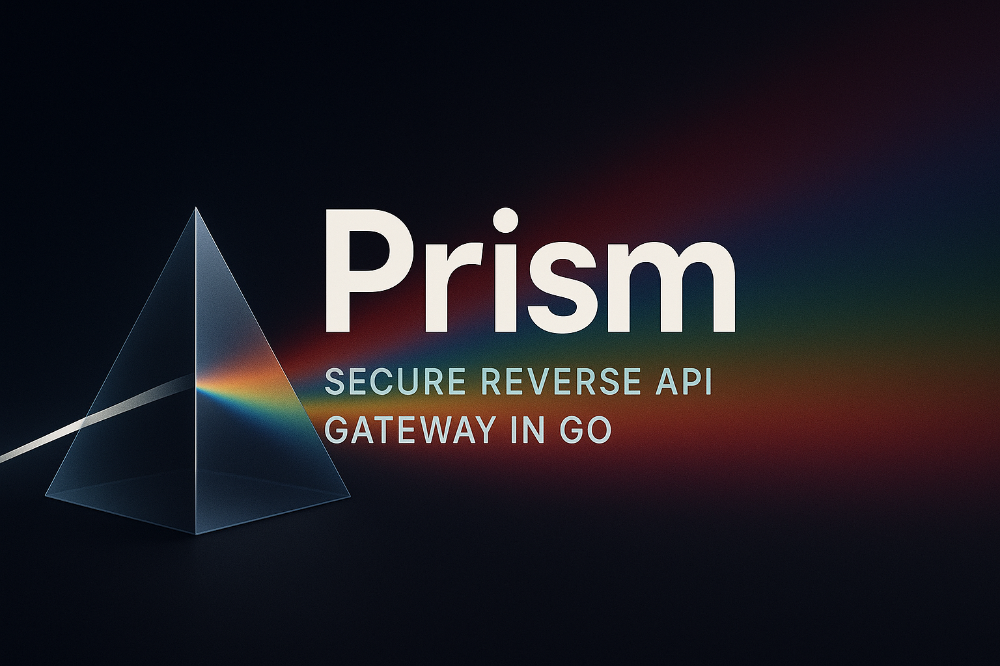
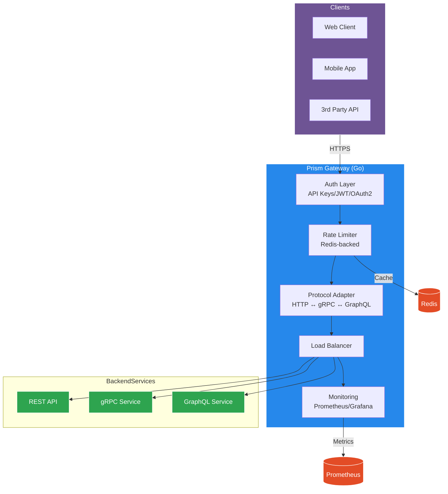

# Prism



[](https://goreportcard.com/report/github.com/salgue441/prism)
[](LICENSE)
[](https://github.com/salgue441/prism/releases)
[](https://hub.docker.com/r/yourusername/prism)

**Prism** is a high-performance reverse API gateway written in **Go**, acting as a secure and intelligent entry point for external clients to access internal microservices.

## 🚀 Features

| Category      | Badges                                                                                                                                                                                                            |
| ------------- | ----------------------------------------------------------------------------------------------------------------------------------------------------------------------------------------------------------------- |
| **Auth**      |                                                                           |
| **Protocols** |                       |
| **Infra**     |    |

## 🏗️ Architecture


```mermaid
flowchart TD
subgraph Clients
A[Web Client]
B[Mobile App]
C[3rd Party API]
end

    subgraph Prism["Prism Gateway (Go)"]
        D[Auth Layer\nAPI Keys/JWT/OAuth2]
        E[Rate Limiter\nRedis-backed]
        F[Protocol Adapter\nHTTP ↔ gRPC ↔ GraphQL]
        G[Load Balancer]
        H[Monitoring\nPrometheus/Grafana]
    end

    subgraph BackendServices
        I[REST API]
        J[gRPC Service]
        K[GraphQL Service]
    end

    Clients -->|HTTPS| D
    D --> E
    E --> F
    F --> G
    G --> H
    H -->|Metrics| M[(Prometheus)]
    E -->|Cache| N[(Redis)]

    G --> I
    G --> J
    G --> K

    classDef prism fill:#2688eb,stroke:#fff,color:white;
    classDef client fill:#6e5494,stroke:#fff,color:white;
    classDef storage fill:#e34c26,stroke:#fff,color:white;
    classDef service fill:#2ea44f,stroke:#fff,color:white;

    class Prism prism;
    class Clients client;
    class M,N storage;
    class I,J,K service;
```

## ⚙️ Tech Stack

```go
import (
  "github.com/redis/go-redis/v8"
  "google.golang.org/grpc"
  "github.com/prometheus/client_golang/prometheus"
)
```

## 📦 Quick Start

```bash
# Run with Docker
docker-compose up -d --build

# Or build locally
make build && ./prism -c configs/dev.yaml
```

## 🧪 Testing

```bash
make test          # Run unit tests
make bench         # Run benchmarks
make test-cover    # Test with coverage
```

## 📄 License

Release under [MIT License](./LICENSE) - © 2025 Carlos Salguero
