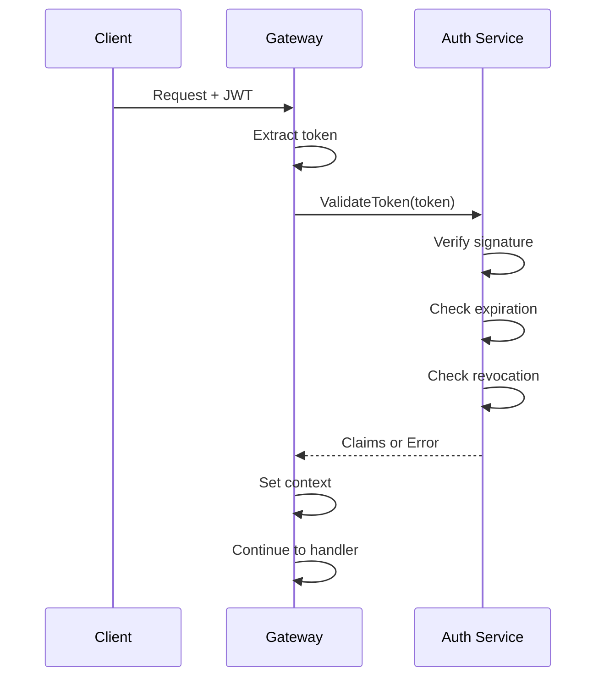

# Authentication Guide

This guide covers authentication mechanisms in Prism.

## Overview

Prism supports multiple authentication methods:

- **JWT Tokens** (RS256) - Primary authentication for API requests
- **OAuth 2.0** - Social login via Google and GitHub
- **API Keys** - Service-to-service authentication

## JWT Authentication

### Token Types

| Type | Purpose | Default TTL |
|------|---------|-------------|
| Access Token | API authorization | 15 minutes |
| Refresh Token | Obtain new access tokens | 7 days |

### Token Structure

Access tokens contain the following claims:

```json
{
  "sub": "user-uuid",
  "email": "user@example.com",
  "roles": ["user", "admin"],
  "session_id": "session-uuid",
  "iss": "prism-auth",
  "iat": 1703001600,
  "exp": 1703002500,
  "jti": "token-uuid"
}
```

### Registration

```bash
curl -X POST http://localhost:8081/auth/register \
  -H "Content-Type: application/json" \
  -d '{
    "email": "user@example.com",
    "password": "SecurePass123!",
    "name": "John Doe"
  }'
```

Response:
```json
{
  "user_id": "uuid",
  "email": "user@example.com",
  "name": "John Doe",
  "created_at": "2024-01-01T00:00:00Z"
}
```

### Login

```bash
curl -X POST http://localhost:8081/auth/login \
  -H "Content-Type: application/json" \
  -d '{
    "email": "user@example.com",
    "password": "SecurePass123!"
  }'
```

Response:
```json
{
  "access_token": "eyJhbGciOiJSUzI1NiIsInR5cCI6IkpXVCJ9...",
  "refresh_token": "eyJhbGciOiJSUzI1NiIsInR5cCI6IkpXVCJ9...",
  "token_type": "Bearer",
  "expires_in": 900,
  "session_id": "uuid"
}
```

### Using Access Tokens

Include the token in the `Authorization` header:

```bash
curl http://localhost:8080/api/v1/resource \
  -H "Authorization: Bearer <access_token>"
```

### Refreshing Tokens

```bash
curl -X POST http://localhost:8081/auth/refresh \
  -H "Content-Type: application/json" \
  -d '{
    "refresh_token": "<refresh_token>"
  }'
```

### Token Revocation

Revoke a specific session:

```bash
curl -X POST http://localhost:8081/auth/logout \
  -H "Authorization: Bearer <access_token>"
```

Revoke all sessions:

```bash
curl -X POST http://localhost:8081/auth/logout-all \
  -H "Authorization: Bearer <access_token>"
```

## OAuth 2.0

### Supported Providers

- Google
- GitHub

### OAuth Flow

1. **Initiate OAuth**
   ```bash
   # Redirects to provider
   GET http://localhost:8081/auth/oauth/google
   GET http://localhost:8081/auth/oauth/github
   ```

2. **Provider Authentication**
   User authenticates with the provider

3. **Callback**
   Provider redirects to callback URL with authorization code

4. **Token Exchange**
   Prism exchanges the code for user info and returns JWT tokens

### Google OAuth Setup

1. Go to [Google Cloud Console](https://console.cloud.google.com/)
2. Create OAuth 2.0 credentials
3. Add authorized redirect URI: `http://localhost:8081/auth/google/callback`
4. Configure in `configs/auth.yaml`:

```yaml
oauth:
  google:
    client_id: "your-client-id.apps.googleusercontent.com"
    client_secret: "your-client-secret"
    redirect_url: "http://localhost:8081/auth/google/callback"
```

### GitHub OAuth Setup

1. Go to [GitHub Developer Settings](https://github.com/settings/developers)
2. Create a new OAuth App
3. Set callback URL: `http://localhost:8081/auth/github/callback`
4. Configure in `configs/auth.yaml`:

```yaml
oauth:
  github:
    client_id: "your-client-id"
    client_secret: "your-client-secret"
    redirect_url: "http://localhost:8081/auth/github/callback"
```

## API Keys

API keys are used for service-to-service authentication.

### Creating an API Key

```bash
curl -X POST http://localhost:8081/auth/api-keys \
  -H "Authorization: Bearer <access_token>" \
  -H "Content-Type: application/json" \
  -d '{
    "name": "Production API",
    "scopes": ["read:users", "write:orders"],
    "expires_at": "2025-01-01T00:00:00Z"
  }'
```

Response:
```json
{
  "key_id": "uuid",
  "key": "prism_sk_live_...",
  "name": "Production API",
  "scopes": ["read:users", "write:orders"],
  "created_at": "2024-01-01T00:00:00Z",
  "expires_at": "2025-01-01T00:00:00Z"
}
```

**Important:** The full API key is only shown once. Store it securely.

### Using API Keys

Include the key in the `X-API-Key` header:

```bash
curl http://localhost:8080/api/v1/resource \
  -H "X-API-Key: prism_sk_live_..."
```

### Listing API Keys

```bash
curl http://localhost:8081/auth/api-keys \
  -H "Authorization: Bearer <access_token>"
```

### Revoking an API Key

```bash
curl -X DELETE http://localhost:8081/auth/api-keys/<key_id> \
  -H "Authorization: Bearer <access_token>"
```

## Gateway Authentication Middleware

The Gateway validates tokens via gRPC with the Auth service:



### Route Authentication Configuration

```yaml
routes:
  # Public route - no auth required
  - path: "/public/*"
    auth_required: false

  # Protected route - JWT required
  - path: "/api/v1/*"
    auth_required: true

  # Role-based access
  - path: "/admin/*"
    auth_required: true
    required_roles: ["admin"]

  # Scope-based access (for API keys)
  - path: "/api/v1/orders"
    auth_required: true
    required_scopes: ["write:orders"]
```

## Security Best Practices

1. **Use HTTPS** - Always use TLS in production
2. **Short Access Token TTL** - 15 minutes or less
3. **Secure Refresh Token Storage** - Use HttpOnly cookies or secure storage
4. **Rotate JWT Keys** - Periodically rotate signing keys
5. **Monitor Failed Attempts** - Alert on repeated authentication failures
6. **Rate Limit Auth Endpoints** - Prevent brute force attacks
7. **Use Strong Passwords** - Enforce password policy

## Troubleshooting

### "Token expired" Error

Access tokens expire after 15 minutes. Use the refresh token to obtain a new access token.

### "Invalid token signature" Error

- Verify the token was issued by your Prism instance
- Check that JWT keys match between Auth service and Gateway
- Ensure the token hasn't been tampered with

### "Token revoked" Error

The user logged out or the session was terminated. Obtain new tokens via login.

### OAuth "State mismatch" Error

- Clear browser cookies and try again
- Ensure the callback URL matches configuration exactly
- Check that the OAuth state hasn't expired (5 minutes)
